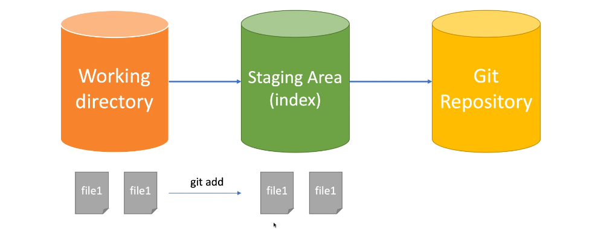
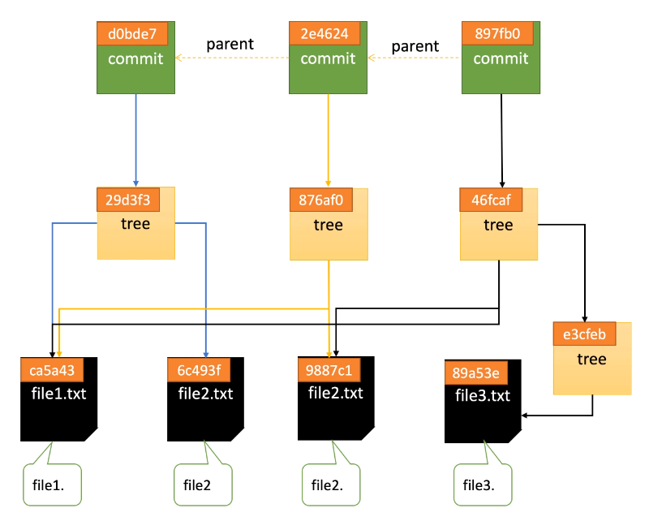

## 🐳 前言
因為在工作上大量的用到 git 這個版控工具，所以想好好了解自己每個用到的指令背後實際上發生了什麼事，上了一堂 udemy 的課，寫了一些小筆記。

筆記來源大部分參考自：https://www.udemy.com/course/git-basic/

## 🐳 Git Local 基本原理解析

### 🦀 Git 的設定
通常在看各式各樣的 git 教學的時候，會看到當使用者下載好 git 之後，教學的下一個步驟是在終端機打入以下指令：
```git
git config --global user.email "[your email]"
git config --global user.name "[your name]"
```

這兩行的意思其實會在根目錄建立一個 global 的 git 設定檔（檔名是 .gitconfig），而且這個設定檔會自動帶入到每一個 git repository。除了這個 global 的 git 設定檔之外，每一個 git repository 裡面都有自己的 git 設定檔，可以進到該 repo 透過 `git config --list` 指令查看。

除了設定使用者之外，git config 其實還可以做非常多其他的設定，來達到 git 的客製化。

:::tip
git repository 會優先採用 local config 的設定，再使用 global config 的設定。
:::

### 🦀 初始化代碼倉庫
建立一個 git repository 主要有兩種方法：
- git clone 遠端的倉庫
- 建立本地倉庫，再使用 git init

透過這兩種方式都可以發現 git repository 裡面出現了一個 **.git** 的資料夾，可以在終端機裡面透過 `ls -a` 這個指令看到這個資料夾，透過觀察這個資料夾的變化，可以很好地理解 git 是如何運作的。

首先先在這邊放上一個最基本的 .git 資料夾的架構，接下來會透過這個資料夾的變動來一一理解 git 如何運作。
```git
.git
├── branches
├── config
├── description
├── HEAD
├── hooks
├── info
│   └── exclude
├── objects
│   ├── info
│   └── pack
└── refs
    ├── heads
    └── tags
```

### 🦀 git add [file] 背後發生了什麼
當建立一個檔案，並將其透過 `git add [檔名]` 加入 tracked file 的時候，可以發現 .git 資料夾發生了變化，我們假設目前的變化如下：
```git
.git
├── branches
├── config
├── description
├── HEAD
├── hooks
├── info
│   └── exclude
├── index // 多了這個
├── objects
|   ├── 54 // 多了這個
│   │   └── 7fe984c2f69bd68e98fca67f99a5c14d1435aa // 多了這個
│   ├── info
│   └── pack
└── refs
    ├── heads
    └── tags
```

可以發現 .git 裡面的 objects 資料夾中多了另外一串奇怪的數字，這一串數字是透過稱為 SHA1 的加密算法算出來的，如果要查看任何有關 objects 資料夾當中的東西的話，可以在終端機當中輸入以下指令：
```git
git cat-file -t 547fe9 // 只取前六位即可
git cat-file -p 547fe9

-t: 查看該檔案的類型
-p: 查看該檔案的內容
-s: 查看該檔案的大小
```

在終端機下了上述這兩個指令之後，可以發現透過 `git add [file]` 之後，產生的 object 類型是　blob 而裡面的內容則是檔案裡面的文字內容，另外一個很重要的是，我們發現到這個 object 並沒有儲存檔名。（檔名會存在另外一個地方）

### 🦀 blob 對象與 SHA1 哈希

- HASH 算法：將任意長度的輸入透過 HASH 算法變換成固定長度的輸出，常常被用來做加密。
- 常見的 HASH 算法，括號當中的 bit 表示會輸出多少 bit 的字串：
  - MD5 (128 bit) （已被破解）
  - SHA1 (160 bit) （已被破解）
  - SHA256 (256 bit) 
  - SHA512 (512 bit)

`git add [file]` 之後， git 會根據檔案的類型、大小、修改的內容來產生 HASH 值，然後存到 .git/objects 當中，同時也會壓縮內容。目前 git 算出 HASH 值的方式都是用 SHA1 算法。

### 🦀 Working Directory 和 Staging Area
git 的工作區大致上可以分成三種不同的類型來理解，分別是 Working Directory、Staging Area、git repository。如下圖所示：



在檔案尚未被 git 追蹤的時候，會停留在 Working Directory，任何需要被 git 控管的檔案都需要使用 `git add [file]` 這個指令，來將檔案加入到 Staging Area，最後透過撰寫 commit 存到 git repository 裡面。

在圖中可以看到，Staging Area 下面有一個 index 的字樣，沒錯，有關 Staging Area 的任何訊息都會被儲存在 .git/index 這個資料夾當中。我們可以透過以下指令去檢視目前在 index 的檔案有哪些：
```
git ls-files // 只顯示檔名
git ls-files -s // 顯示檔名、該檔案的權限、文件內容
```

:::tip
所以可以知道，前面提到的 blob object 只儲存文件內容，而文件的檔名會儲存在 index（索引區）。可以透過 `git status` 指令來觀察 Staging Area 和 Working Directory 的變化。
:::

### 🦀 git commit 背後發生了什麼
將文件加入到 Staging Area 之後，接著要使用 `git commit -m "message"` 來生成 commit，生成 commit 的目的是為了將有修改的地方存到代碼倉庫（git repository）當中，那麼 commit 在生成的時候，究竟是生成了什麼呢？

生成一個 commit 之後，git 也會透過 SHA1 算法為每個 commit 算出一組編碼，這時候我們也可以運用上面提到的 `git cat-file` 指令去觀察 commit 的類型和內容。透過該指令我們可以知道 commit 的類型是 commit，而內容則是 tree 和作者資訊，如下圖範例：


tree 當中會儲存前面提到的 blob object，也就是說，tree 裡面存的是目前這個 commit 有修改到的所有檔案。再者，如果這個 commit 是接在另一個 commit 後面的話，除了 tree 之外，則會額外再多看到一個 parent，這個 parent 標示著這個 commit 是接在某個特定的 commit 之後。

除了觀察 commit 本身之外，我們也可以觀察有 commit 的分支，假設輸入以下指令：
```git
cat .git/refs/heads/master
```

就可以看到這個 master 的分支最新的 commit 是哪一個。

另外 .git 當中還有一個資料夾稱作 HEAD，可以將 HEAD 想像成一個指針，這個 HEAD 的用途是用來指向目前所在的分支。可以透過以下指令去查看 .git/HEAD 的內容：
```git
cat .git/HEAD
```

### 🦀 Commit History Tree
在前面的幾個部份當中，我們可以發現不管是使用 `git add` 或 `git commit -m`  git 都會透過 SHA1 算法來生成一個 git object，而這些 object 都會指向各自關聯到的另外一個 git object，比如說新的 commit 會指向上一個 commit，以此類推，如果有很多個 commit 的話，我們就可以透過這樣的方式去知道整個 commit history。而每一個 commit 會指向該 commit 有修改到的檔案（blob object），透過這個指向，我們也可以知道每一個 commit 修改了什麼。

這樣子不斷指向的過程便會形成一個 commit history tree（如下圖），而我們也可以知道，這樣的結構就是 git 的版本概念。



## 🐳 Branch 和 HEAD

### 🦀 什麼是分支？什麼是HEAD？
在整個 git 版本控制的工作流程當中有一個非常重要的概念，就是分支，在程式開發的流程當中會不斷遇到建立分支、合併分支的過程，在開始講解基本操作之前，先來解釋一下到底什麼是分支？

翻翻 git 的官方文件後，我們可以看到 git 對分支的解釋：
> Branches are named pointers to commits.

從以上敘述可以知道，分支只是一個指向某個 commit 的指針。此時我們就會知道如果要讓分支這個功能可以運作需要達成兩個條件：
1. 要有一個地方可以儲存每個分支指向的哪個 commit 這件事情。 ➡️ 存在 .git/refs/heads/[branch 名稱] 裡面。
2. 要有一個東西可以讓我們知道我們現在在哪一個分支上面。 ➡️ 透過 HEAD 來實現，也就是說只要看 HEAD 指向哪個分支，我們現在就在哪個分支。（HEAD 存在 .git/HEAD）

### 🦀 分支的基本操作
1. ```git branch```：查看目前有哪些分支。如果該分支前面出現 * 字號，表示那是現在所在的分支。
2. ```git branch [branch 名稱]```：創建分支。
3. ```git checkout [branch 名稱]```：切換現在的分支到另外一個分支。
4. ```git branch -d [branch 名稱]```：刪除分支。如果分支沒有 merge 的話，會出現無法刪除分支的提示訊息。
5. ```git branch -D [branch 名稱]```：強制刪除分支。就算分支沒有 merge 也可以刪除。
6. ```git reflog```：會記錄所有在 git 當中的操作，包括被刪除分支的 commit。
7. ```git branch -m [舊 branch 名稱] [新 branch 名稱]```：重新命名分支名稱。
8. ```git checkout -b [branch 名稱]```：創建分支並且切換到該分支。

:::caution
注意：如果現在所在的分支是想要刪除的分支的話，就不能刪除分支。要先移動到別的分支，才能刪除。
:::

### 🦀 使用 git checkout 出特定的 commit

`git checkout` 除了可以用來切換分支之外，也可以用來找出某個特定的 commit。如果不小心刪除了某個分支，可以先用 `git reflog` 找到被刪除分支的 commit，然後再建立分支，就可以恢復被刪除的分支。如下步驟：
```
1. git reflog
2. git checkout [commit sha1值(六個字)]
3. git checkout -b [被刪除的 branch 名稱]
```

這個用法平常不太常用到，但在特殊情況下特別有用！

:::caution
**刪除分支到底刪除了什麼？** 刪除分支時，只會刪除分支這個指針，並不會刪除任何的 commit！
:::

### 🦀 關於 git diff 這個命令

現在應該也比較少在用 `git diff` 這個指令了，因為 IDE 可以直接顯示檔案變動的情況，非常方便，但其實也可以透過在終端機打下指令 `git diff` 來查看 working directory 和 staging area 中文件之間的差別。

如果要查看 staging area 和 git repository 的差別的話，可以用 `git diff --cache` 來查看。

## 🐳 分支合併（Branch Merge）

當團隊裡的人在不同的分支開發完之後，會需要將所有的分支都合併在一起，才是一個完整的應用。此時合併分支時會有幾個不同的狀況。這個單元會一一介紹。

### 🦀 Fast Forward Merge

算是在合併分支的時候遇到的最簡單的一種。

假設目前有兩個分支，分別是 mater 和 bugfix。bugfix 是基於 master 最新的 commit 所創建的另外一個分支，我們在 bugfix 上新增了一個 commit。此時整個 branch 和 commit 的結構大致上如下圖所示：


在這樣的結構之下進行 git merge 的話，master branch 的指針會向右移動，會與 bugfix 位於同一個 commit，稱之為 fast forward merge。在這裡簡單總結符合 fast forward merge 的條件：
- 分支 B 合併進 分支 A 的時候，分支 B 的 第一個 commit 指向分支 A 最新的 commit。

### 🦀 3 Way Merge

### 🦀 3 Way Merge with Conflict

### 🦀 git rebase 是什麼？
