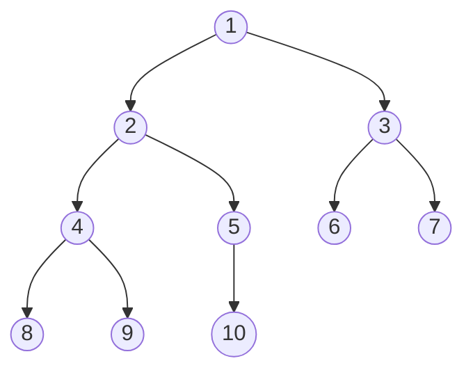

## 🐳 Definition 定義

在 leetcode 的教學當中，樹的定義如下：

> A `tree` is a frequently-used data structure to simulate a hierarchical tree structure.

> Each node of the tree will have a root value and a list of references to other nodes which are called child nodes. From graph view, a tree can also be defined as a directed acyclic graph which has `N nodes` and `N-1 edges`.

二元樹的定義如下：

> A `Binary Tree` is one of the most typical tree structure. As the name suggests, a binary tree is a tree data structure in which each node has `at most two children`, which are referred to as the left child and the right child.

簡單來說，如果將二元樹畫成圖的話，會長得像下面的樣子：



## 🐳 How to Traverse A Tree 遍歷二元樹

與二元樹相關最常見的 leetcode 題就是如何遍歷二元樹了，遍歷指的是在不重複的情況下，存取樹的所有節點。目前有三種方式可以遍歷二元樹

### 🦀 Pre-order Traversal

順序：
1. 中
2. 左
3. 右

```

```

### 🦀 In-order Traversal

順序：
1. 左
2. 中
3. 右


### 🦀 Post-order Traversal

順序：
1. 左
2. 右
3. 中

DFS 遞迴

## 🐳 學習資源
- https://leetcode.com/explore/learn/card/data-structure-tree/
- https://hackmd.io/@Aquamay/HyCgHXfid
