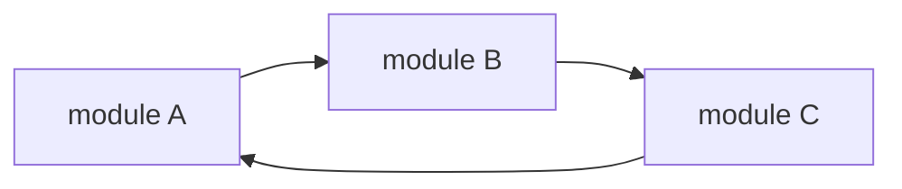
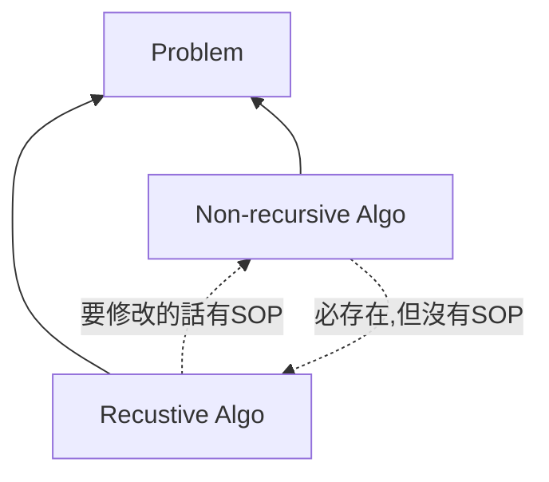

## 🐳 遞迴的種類

如果一個 function 裡面有 self-calling 的敘述，便稱為遞迴，遞迴概略可以分為三個種類，分別是：
- Direct Recursion
- Indirect Recursion
- Tail Recursion

下面舉一些簡單的例子來說明這三個遞迴。

### 🦀 Direct Recursion

Direct Recursion，直接遞迴，應該蠻好理解的。如果某個 function 在 function 內部呼叫自己，就可以稱為直接遞迴。可以參考下面的 psuedo code：

```c
void directRecursionFunction()
{
  // some code...

  directRecursionFunction();

  // some code...
}
```

### 🦀 Indirect Recursion

Indirect Recursion，間接遞迴，意思是指多個 module 之間，彼此互相呼叫，形成 calling cycle。例如：假設目前有三個 function：`module A`、`module B`、`module C`，這三個 function 彼此互相呼叫，便會形成間接遞迴，如下圖。



:::note
像上面那種 function 互相 call 來 call 去，互相高度依賴的狀況（高耦合），盡量不要在實際開發中出來，會很可怕。
:::

### 🦀 Tail Recursion

Tail Recursion，尾端遞迴，其實是直接遞迴的一種，只是在 recursion 之後，下一個可執行的敘述就是 END 敘述。會特別把這個種類帖出來是因為這種地回可以在 compiler 裡面做到最佳化。（最佳化的意思，某種程度上可以理解成「將遞迴改成非遞迴」）

## 🐳 Recursion v.s. Iteration(Non-recusrion)

- 任何問題的解法必定可以用兩種演算法去解決：遞迴與非遞迴。
- 遞迴與非遞迴演算法兩者可以互相轉換
  - 遞迴改為非遞迴，有標準 SOP
  - 非遞迴改回遞迴，沒有標準 SOP（需要靈感）

#### 示意圖



#### 比較表

||遞迴|非遞迴|
|---|---|---|
|程式碼|較精簡|較冗長|
|區域變數、暫存變數|使用很少或是沒有|使用量多|
|表達問題的能力|powerful|weak|
|除錯|困難|容易|
|程式執行時間|較久，比較沒有效率|較短，較有效率|
|memory stack 空間|需要額外的 stack 空間支持，所以執行時需要較多的動態空間|無需 stack support|

## 🐳 題目練習

### 🦀 Factorial N! 階乘
