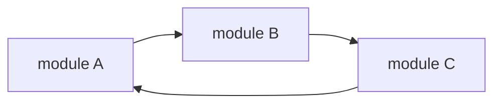
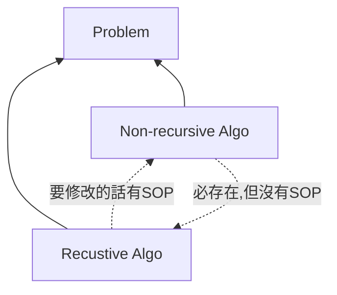

## 🐳 遞迴的種類

如果一個 function 裡面有 self-calling 的敘述，便稱為遞迴，遞迴概略可以分為三個種類，分別是：
- Direct Recursion
- Indirect Recursion
- Tail Recursion

下面舉一些簡單的例子來說明這三個遞迴。

### 🦀 Direct Recursion

Direct Recursion，直接遞迴，應該蠻好理解的。如果某個 function 在 function 內部呼叫自己，就可以稱為直接遞迴。可以參考下面的 psuedo code：

```c
void directRecursionFunction()
{
  // some code...

  directRecursionFunction();

  // some code...
}
```

### 🦀 Indirect Recursion

Indirect Recursion，間接遞迴，意思是指多個 module 之間，彼此互相呼叫，形成 calling cycle。例如：假設目前有三個 function：`module A`、`module B`、`module C`，這三個 function 彼此互相呼叫，便會形成間接遞迴，如下圖。



:::note
像上面那種 function 互相 call 來 call 去，互相高度依賴的狀況（高耦合），盡量不要在實際開發中寫出來，會很可怕。
:::

### 🦀 Tail Recursion

Tail Recursion，尾端遞迴，其實是直接遞迴的一種，只是在 recursion 之後，下一個可執行的敘述就是 END 敘述。會特別把這個種類帖出來是因為這種地回可以在 compiler 裡面做到最佳化。（最佳化的意思，某種程度上可以理解成「將遞迴改成非遞迴」）

## 🐳 Recursion v.s. Iteration(Non-recusrion)

- 任何問題的解法必定可以用兩種演算法去解決：遞迴與非遞迴。
- 遞迴與非遞迴演算法兩者可以互相轉換
  - 遞迴改為非遞迴，有標準 SOP
  - 非遞迴改回遞迴，沒有標準 SOP（需要靈感）

#### 示意圖



#### 比較表

||遞迴|非遞迴|
|---|---|---|
|程式碼|較精簡|較冗長|
|區域變數、暫存變數|使用很少或是沒有|使用量多|
|表達問題的能力|powerful|weak|
|除錯|困難|容易|
|程式執行時間|較久，比較沒有效率|較短，較有效率|
|memory stack 空間|需要額外的 stack 空間支持，所以執行時需要較多的動態空間|無需 stack support|

## 🐳 題目練習

### 🦀 Factorial N! 階乘

#### Question 1: Write an Interative function Fac(N) or pseudo code for N!

```javascript
function fac(n) {
  let result = 1;
  for (let i = 1; i <= n; i++>) {
    result = result * i;
  }
  return result;
}
```

#### Question 2: Write a Recursive function Fac(N) or pseudo code for N!

先把階乘的遞迴數學定義寫出來：

$$
n! =
\begin{cases}
1,\ if\ n \ne 0 \\
(n-1)! * n,\ if\  n > 0
\end{cases}
$$

然後再寫出遞迴的程式碼：

```javascript
function fac(n) {
  if (n === 0) {
    return 1;
  } else {
    return fac(n-1) * n;
  }
}
```

:::tip
解遞迴相關問題的訣竅：先想出遞迴的數學定義，再把數學定義轉換成程式碼！
:::

### 🦀 Fibonacci Number

#### Definition

$$
F_{0} = 0,\ F_{1} = 1,\ F_{n} = F_{n-1} + F_{n-2},\ for\ n \ge 2
$$

#### Question 1: Write a Recurisive function for Fib(N)

```js
function fib(n) {
  if (n === 0) {
    return 0;
  }
  if (n === 1) {
    return 1;
  }
  return fib(n-1) + fib(n-2);
}
```

#### Quesiton 2: Write a Interative function for Fib(N)

```js
function fib(n) {
  if (n === 0) {
    return 0;
  } else if (n === 1) {
    return 1;
  } else {
    let a = 0;
    let b = 1;
    let c;
    for (let i = 2; i <= n; i++) {
      c = a + b;
      a = b;
      b = c;
    }
    return c;
  }
}
```

### 🦀 Greatest Common Divisor (GCD) 最大公因數

#### Definition

用輾轉相除法來計算兩個數字（A, B）的最大公因數，定義如下：

$$
\begin{cases}
B,\ if\ (A \mod B) = 0 \\
GCD(B, A \mod B),\ otherwise
\end{cases}
$$

#### Write the recursive code for GCD(A, B)

```js
function gcd(a, b) {
  if (a % b === 0) return b;
  return gcd(b, a % b);
}
```

### 🦀 Tower of Hanoi 河內塔

非常經典的遞迴題目，但還沒唸（囧），唸完再回來補上筆記ＱＱ
