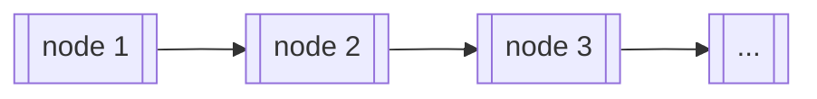

## 🐳 寫在前面

這邊想要紀錄一些開始念資料結構之後的初步感想，讓未來的自己可以回顧。可能不一定是對的，但就是感想。

雖然不同的程式語言會因為不同的特性提供一些資料型態，比如 JavaScript 有 number, string, boolean, array, class 等等。資料結構比較像是一種以現有的資料型態去設計某種結構，該種結構之所以被設計出來可能是因為時間與空間上的效能考量，或是用來解決需求的問題。

所以學資料結構的時候，除了搞懂每個資料結構的長相、特性、刷題，更需要知道一些實際的應用情境，想要解決什麼樣的問題。

## 🐳 Array and Linked List

在理解什麼是 stack 跟 queue 之前，要先理解 array 和 linked list 這兩種不同的資料結構。因為 stack 和 queue 其實可以用 array 或是 lnked list 來實作。

array 應該就不用特別解釋了，但如果第一個學習的程式語言是 JavaScript，又沒有學過資料結構的話，可能不會遇到 linked list 這種資料結構。

以我目前的理解來說。C 語言的 array 在宣告的時候也要同時宣告長度，也就是說宣告了 array 需要用到的記憶體用量，所以 array 的長度會是固定的，沒有辦法動態調整。

如果想要使用 C 語言創造一個動態長度的陣列，可以拿取記憶體中任一的單一區塊來存放 data（稱為節點 node），亦即放入值和指標，然後用指標指向下個節點（node），串成一個陣列，類似下圖的概念：

|| array | linked list |
|--|--|--|
| 優點 | <ul><li>random access：只要利用 index 即可在 O(1) 時間對 array 的資料做存取。</li><li>較節省記憶體空間，linked list 需要多一個 pointer 來記錄下一個 node 的記憶體位置。</li></ul> | <ul><li>新增或刪除資料較 array 簡單，只要對所有欲新增/刪除的 node 調整 pointer 即可（時間複雜度：O(1)），不需要如同 array 般搬動其餘元素。</li><li>linked list 的資料數量可以是動態的，不像 array 會有 resize 的問題。</li></ul> |
| 缺點 | <ul><li>新增或刪除資料較麻煩，若要在第一個位置新增資料，就需要 O(n) 時間把 array 中所有元素往後移動。同理，若要刪除第一個位置的資料，也需要 O(n) 時間把 array 中剩餘的元素往前移動。</li><li>若資料數量時常在改變，要時常調整矩陣的大小，會花費O(n)的時間在搬動資料。</li></ul> | <ul><li>linked list 沒有 index，若要找到特定 node，需要從頭開始找起，搜尋的時間複雜度為O(n)。</li><li>需要額外的記憶體空間來儲存 pointer。</li></ul> |

## 🐳 Stack

## 🐳 Queue

## 🐳 在前端的實際應用

## 🐳 Resource
- [Linked List: Intro(簡介)](http://alrightchiu.github.io/SecondRound/linked-list-introjian-jie.html) by Chiu CC
- [你所不知道的 C 語言: linked list 和非連續記憶體](https://hackmd.io/@sysprog/c-linked-list) by jserv 大大