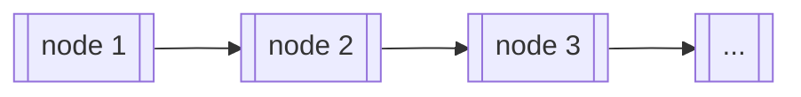

import Figure from "@site/src/components/Figure";
import StackImg from "./images/stack.png";
import QueueImg from "./images/queue.png";
import Tabs from "@theme/Tabs";
import TabItem from "@theme/TabItem";

## 🐳 寫在前面

這邊想要紀錄一些開始念資料結構之後的初步感想，讓未來的自己可以回顧。可能不一定是對的，但就是感想。

雖然不同的程式語言會因為不同的特性提供一些資料型態，比如 JavaScript 有 number, string, boolean, array, class 等等。資料結構比較像是一種以現有的資料型態去設計某種結構，該種結構之所以被設計出來可能是因為時間與空間上的效能考量，或是用來解決需求的問題。

所以學資料結構的時候，除了搞懂每個資料結構的長相、特性、刷題，更需要知道一些實際的應用情境，想要解決什麼樣的問題。

## 🐳 Array and Linked List

在理解什麼是 stack 跟 queue 之前，要先理解 array 和 linked list 這兩種不同的資料結構。因為 stack 和 queue 其實可以用 array 或是 lnked list 來實作。

array 應該就不用特別解釋了，但如果第一個學習的程式語言是 JavaScript，又沒有學過資料結構的話，可能不會遇到 linked list 這種資料結構。

以我目前的理解來說。C 語言的 array 在宣告的時候也要同時宣告長度，也就是說宣告了 array 需要用到的記憶體用量，所以 array 的長度會是固定的，沒有辦法動態調整。

如果想要使用 C 語言創造一個動態長度的陣列，可以拿取記憶體中任一的單一區塊來存放 data（稱為節點 node），亦即放入值和指標，然後用指標指向下個節點（node），串成一個鍵結串列，類似下圖的概念：



### 🦀 Array 和 Linked List 的簡單比較

|      | array                                                                                                                                                                                                                                                                                   | linked list                                                                                                                                                                                                                        |
| ---- | --------------------------------------------------------------------------------------------------------------------------------------------------------------------------------------------------------------------------------------------------------------------------------------- | ---------------------------------------------------------------------------------------------------------------------------------------------------------------------------------------------------------------------------------- |
| 優點 | <ul><li>random access：只要利用 index 即可在 `O(1)` 時間對 array 的資料做存取。</li><li>較節省記憶體空間，linked list 需要多一個 pointer 來記錄下一個 node 的記憶體位置。</li></ul>                                                                                                     | <ul><li>新增或刪除資料較 array 簡單，只要對所有欲新增/刪除的 node 調整 pointer 即可（時間複雜度：`O(1)`），不需要如同 array 般搬動其餘元素。</li><li>linked list 的資料數量可以是動態的，不像 array 會有 resize 的問題。</li></ul> |
| 缺點 | <ul><li>新增或刪除資料較麻煩，若要在第一個位置新增資料，就需要 `O(n)` 時間把 array 中所有元素往後移動。同理，若要刪除第一個位置的資料，也需要 `O(n)` 時間把 array 中剩餘的元素往前移動。</li><li>若資料數量時常在改變，要時常調整矩陣的大小，會花費 `O(n)` 的時間在搬動資料。</li></ul> | <ul><li>linked list 沒有 index，若要找到特定 node，需要從頭開始找起，搜尋的時間複雜度為 `O(n)`。</li><li>需要額外的記憶體空間來儲存 pointer。</li></ul>                                                                            |

## 🐳 Stack 堆疊

Stack 和 Queue 都是可以用來加入資料、取回資料的抽象資料結構，只是他們加入資料和取回資料的 order 不同。

Stack 是採取 **LIFO（last-in, first-out）** 的方式。最後加入 stack 的資料會最先被讀取。加入資料的方式稱為 `push`，取回資料的方式稱為 `pop`。如下面的示意圖：

<Figure src={StackImg} caption="圖片來源：維基百科" />

stack 的介面描述大致如下：

:::info
Stack ADT (abstract data type)：

- **`create()`**: create an empty stack
- **`isFull()`**: return true if the stack is full, otherwise return false
- **`isEmpty()`**: return true if the stack is empty, otherwise return false
- **`push(new-item)`**: add a new item to the top of the stack
- **`pop()`**: remove the top element from the stack and return it to the caller
- **`top()`**: return the top element of the stack without removing it
:::

### 🦀 用 Array 來實作 Stack

<Tabs groupId="programming-language">
<TabItem value="javascript" label="JavaScript" default>

```javascript
class Stack {
  constructor() {
    this.items = [];
  }

  get isEmpty() {
    return this.items.length === 0;
  }

  get stackSize() {
    return this.items.length;
  }

  push = (item) => {
    this.items.push(item);
  };

  pop = () => {
    if (this.isEmpty) {
      return null;
    }
    return this.items.pop();
  };

  top = () => {
    return this.items[this.stackSize - 1];
  };

  // isFull 省略
  // 因為 JavaScript 的 array size 動態的，所以沒有特別設計的話就不會 full
}
```

</TabItem>
</Tabs>

### 🦀 用 Linked List 來實作 Stack

<Tabs groupId="programming-language">
<TabItem value="javascript" label="JavaScript" default>

```js
// a linked list node
class Node {
  constructor(data, next) {
    this.data = data;
    this.next = next;
  }
}

// a stack using linked list
class Stack {
  constructor() {
    this.top = null;
    this.size = 0;
  }

  get isEmpty() {
    return this.size === 0;
  }

  push = (item) => {
    const newNode = new Node(item, this.top);
    this.top = newNode;
    this.size++;
  };

  pop = () => {
    if (this.isEmpty) {
      return null;
    }
    const poppedNode = this.top;
    const newTopNode = this.top.next;
    poppedNode.next = null;
    this.top = newTopNode;
    this.size--;
    return poppedNode.data;
  };

  getTop = () => {
    if (this.isEmpty) {
      return null;
    }
    return this.top.data;
  };
}
```

</TabItem>
</Tabs>

## 🐳 Queue 佇列

Queue 存取資料的順序是採取先進先出的方式，也就是 **first in first out(FIFO)**。將資料存入 Queue 裡面稱為 `enqueue`，將資料從 Queue 中取出稱為 `dequeue`。概念如下圖所示：

<Figure src={QueueImg} caption="圖片來源：維基百科" />

:::info
Queue ADT:

- **`enqueue()`**: adds an element to the rear of the queue
- **`dequeue()`**: removes an element from the front of the queue
- **`isEmpty()`**: determines whether the queue is empty
- **`isFull()`**: determines whether the queue is full
- **`first or front element`**: return the element at the front of the queue if it is not empty
:::

### 🦀 用 Linear Array 來實作 Queue

<Tabs groupId="programming-language">
<TabItem value="javascript" label="JavaScript" default>

```js
class Queue {
  constructor() {
    this.items = [];
  }

  get isEmpty() {
    return this.items.length === 0;
  }

  getFront = () => {
    return this.items[0];
  }

  enqueue = (item) => {
    this.items.push(item);
  };

  dequeue = () => {
    this.items.shift();
  };
}
```

</TabItem>
</Tabs>

### 🦀 用 Circular Array 來實作 Queue

<Tabs groupId="programming-language">
<TabItem value="javascript" label="JavaScript" default>

```js
class circularQueue {
  constructor(arraySize) {
    this.items = new Array(arraySize);
    this.rear = this.items.length - 1;
    this.front = 0;
    this.size = 0;
  }

  get isEmpty() {
    return this.size === 0;
  }

  get isFull() {
    return this.size === this.items.length;
  }

  enQueue = (item) => {
    if (this.isFull) return null;
    this.rear = (this.rear + 1) % this.items.length;
    this.items[this.rear] = value;
    this.size++;
  }

  deQueue = () => {
    if (this.isEmpty) return null;
    this.front = (this.front + 1) % this.items.length;
    this.size--;
  }

  getFront = () => {
    return this.isEmpty ? -1 : this.items[this.front];
  }

  getRear = () => {
    return this.isEmpty ? -1 : this.items[this.rear];
  }
}
```

</TabItem>
</Tabs>

### 🦀 用 Linked List 來實作 Queue

<Tabs groupId="programming-language">
<TabItem value="javascript" label="JavaScript" default>

```js
class Node {
  constructor(data, next) {
    this.data = data;
    this.next = next;
  }
}

class Queue {
  constructor() {
    this.front = null;
    this.rear = null;
    this.size = 0;
  }

  get isEmpty() {
    return this.size === 0;
  }

  enqueue = (item) => {
    const newNode = new Node(item, null);
    if (!this.front) {
      this.front = newNode;
      this.rear = newNode;
    } else {
      this.rear.next = newNode;
      this.rear = newNode;
    }
    this.size++;
  }

  dequeue = () => {
    if (!this.front) {
      return null;
    }
    const dequeuedItem = this.front;
    const nextItem = this.front.next;
    if (this.front.data === this.rear.data) {
      this.rear = null
    }
    this.front = nextItem;
    this.size--;
    return dequeuedItem.data;
  }

  getFront = () => {
    return this.front.data;
  }

  getRear = () => {
    return this.rear.data;
  }
}
```

</TabItem>
</Tabs>

## 🐳 實際應用

### 🦀 前端

#### Stack

- error call stack
- 瀏覽器的歷史紀錄
- 文本或是圖片編輯器的操作紀錄（可以用來做複製復原等等）
- javascript call stack（javascript 用來處理函數執行的方法）

#### Queue

- 瀏覽器的非同步處理（event queue / task queue）
- 通知功能

### :crab: 其他

#### Stack
- parse context-free languages
- evaluate arithmetic expressions(infix, postfix, prefix)
- function call, recursive call management
- reverse the input data
- traverse trees(preorder, inorder, postorder)
- DFS graph traversal
- eight queen problem
- maze problem

#### Queue
- OS 中的各種應用：ready queue、waiting queue、job queue、I/O Derive queue etc.
- buffering
- 基於佇列理論的計算機效能模擬
- 圖形的 BFS
- binary tree 的 level order traversal

## :whale: 題目練習

## 🐳 Resource

- [Linked List: Intro(簡介)](http://alrightchiu.github.io/SecondRound/linked-list-introjian-jie.html) by Chiu CC
- [你所不知道的 C 語言: linked list 和非連續記憶體](https://hackmd.io/@sysprog/c-linked-list) by jserv 大大
