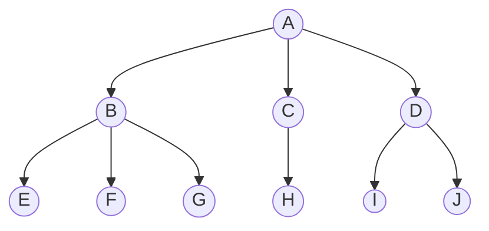
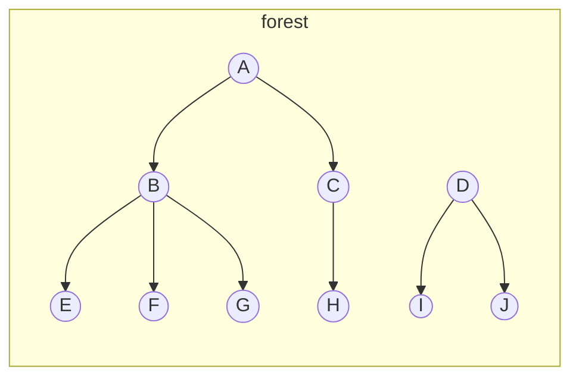
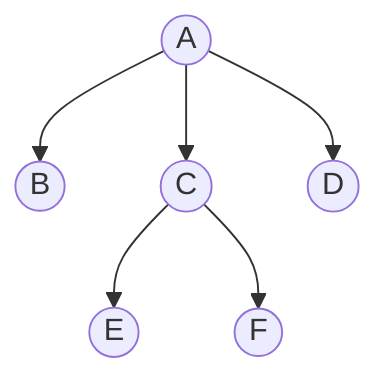
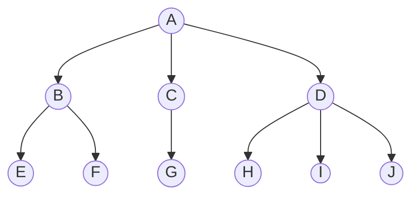

## 🐳 Tree 樹

## 🦀 定義

- 由至少一個 node 組成，不得為空。
- 至少有一個特定 node 稱為 root。
- 其餘 nodes 分為 $T_{1}$ ~ $T_{m}$ 個集合，稱為 subtree of root。

以下圖的 tree 為例說明用來描述 tree 的名詞：

- **node's degree**：一個 node 擁有的 subtree（子樹）的個數。例如：A 的 degree 是 3，D 的 degree 是 2，J 的 degree 是 0。
- **root**：樹中最上層的 node，也是唯一一個 parent 為 null 的 node。例如：A 是這個 tree 的 root。
- **leaf**：沒有 child/subtree 的 node 稱為 leaf。例如：E、F、G、H、I、J 都是 leaf。
- **non-leaf**：不是 leaf 的 node 稱為 non-leaf。例如：A、B、C、D 都是 non-leaf。
- **parent and child**：以箭頭的指向來區分，被指向者為 child，指向者為 parent，例如：A 是 BCD 的 parent，BCD 是 A 的 children。
- **sibling**：擁有相同 parent 的 node 們，互相稱為 sibling，例如：A 是 BCD 的 parent，所以 BCD 是 siblings。
- **ancestors**：如圖中，以 F 的角度觀察，所有能夠以「指向 parent」的方式找到的 node，都稱為 F 的 ancestors，因此 AB 為 F 的 ancestors。
- **descendants**：如圖中，以 A 的角度觀察，所有能夠以「parent 指向 child」的方式找到的 node，都稱為 A 的 descendant，因此整棵樹除了 A 以外皆為 A 的 descendant，以此類推。
- **node's level**：root 的 level 為 0 或 1，其他 node 的 level 為其 parent 的 level 加一。
- **height**：樹的高度，也就是 node's level 取最大值。
- **tree's degree**：所有 node's degree 取最大值。
- **forest**：由 tree 所形成的集合，可以為空。

## 🦀 Representations 樹的表示方法

### use linked list to represent tree directly

用 linked list 來表示 tree，假設 $tree's\  degree = k$，node 的 structure 可以設計成：

以上面的 node structure 來表示下圖的 tree：

$tree's\ degree = 3$

會變成：

:::caution 缺點
這個方法極度浪費記憶體空間。
:::

:::info WHY
$$
\begin{align*}
& 假設\ tree\ 有\ n\ 個\ node，tree's\ degree = k \\
& \therefore 會需要準備\ n * k\ 條 \ links，其中只有\ n - 1\ 條\ links\ 非\ null。 \\
& \therefore null\ link = nk - (n - 1)\ 條 \\
& \therefore 浪費比例 = \frac{nk - (n - 1)}{nk}，只有在\ n = 2\ 的時候浪費比例最少。
\end{align*}
$$
:::

### child-sibling

還是用 linked list 來表示 tree，但是換一個角度來重新設計 node structure，來解決前一個方法浪費記憶體空間的問題。

來重新設計 node structure 成如下圖的結構：

1. child：pointer，指向 「left-most」 child
2. sibling：pointer，指向 node 右邊的 sibling

現在以上面重新設計的 node structure 來表示下圖的 tree：

$tree's\ degree = 3$

會變成：

### 括號法

用 `父點（子點...子點）` 表示父與子點之間的組成關係，可以巢狀表示。

舉個例子，以括號法來表示下圖的 tree：

可以寫成：`A(B(EF)C(G)D(HIJ))`

## 🐳 Binary Tree 二元樹

### 🦀 定義

由至少一個 node 組成，可以為空，若不為空，則滿足：
  - 有 root 及左右子樹
  - 左右子樹也是 binary tree

### 🦀 Binary Tree 的三個定理

假設 root level = 1

【定理一】 $The\ i^{th}\ level\ in\ a\ binary\ tree\ has\ at\ most\ 2^{i-1}\ nodes$

證明：用數學歸納法

【定理二】

### 🦀 Binary Tree 的種類

## 🐳 Tree and Binary Tree 簡單比較

## 🐳 Resource

- [Tree(樹): Intro(簡介)](http://alrightchiu.github.io/SecondRound/treeshu-introjian-jie.html) by Chiu CC
