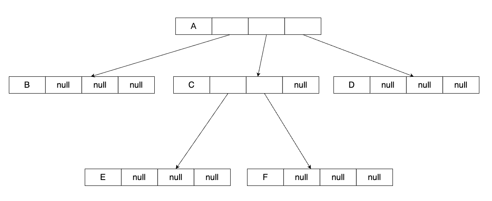

## 🐳 Tree 樹

## 🦀 定義

- 由至少一個 node 組成，不得為空。
- 至少有一個特定 node 稱為 root。
- 其餘 nodes 分為 $T_{1}$ ~ $T_{m}$ 個集合，稱為 subtree of root。

以下圖的 tree 為例說明用來描述 tree 的名詞：

- **node's degree**：一個 node 擁有的 subtree（子樹）的個數。例如：A 的 degree 是 3，D 的 degree 是 2，J 的 degree 是 0。
- **root**：樹中最上層的 node，也是唯一一個 parent 為 null 的 node。例如：A 是這個 tree 的 root。
- **leaf**：沒有 child/subtree 的 node 稱為 leaf。例如：E、F、G、H、I、J 都是 leaf。
- **non-leaf**：不是 leaf 的 node 稱為 non-leaf。例如：A、B、C、D 都是 non-leaf。
- **parent and child**：以箭頭的指向來區分，被指向者為 child，指向者為 parent，例如：A 是 BCD 的 parent，BCD 是 A 的 children。
- **sibling**：擁有相同 parent 的 node 們，互相稱為 sibling，例如：A 是 BCD 的 parent，所以 BCD 是 siblings。
- **ancestors**：如圖中，以 F 的角度觀察，所有能夠以「指向 parent」的方式找到的 node，都稱為 F 的 ancestors，因此 AB 為 F 的 ancestors。
- **descendants**：如圖中，以 A 的角度觀察，所有能夠以「parent 指向 child」的方式找到的 node，都稱為 A 的 descendant，因此整棵樹除了 A 以外皆為 A 的 descendant，以此類推。
- **node's level**：root 的 level 為 0 或 1，其他 node 的 level 為其 parent 的 level 加一。
- **height**：樹的高度，也就是 node's level 取最大值。
- **tree's degree**：所有 node's degree 取最大值。
- **forest**：由 tree 所形成的集合，可以為空。

## 🦀 Representations 樹的表示方法

### use linked list to represent tree directly

用 linked list 來表示 tree，假設 $tree's\  degree = k$，node 的 structure 可以設計成：

以上面的 node structure 來表示下圖的 tree：

$tree's\ degree = 3$

會變成：

:::caution 缺點
這個方法極度浪費記憶體空間。
:::

:::info WHY
$$
\begin{align*}
& 假設\ tree\ 有\ n\ 個\ node，tree's\ degree = k \\
& \therefore 會需要準備\ n * k\ 條 \ links，其中只有\ n - 1\ 條\ links\ 非\ null。 \\
& \therefore null\ link = nk - (n - 1)\ 條 \\
& \therefore 浪費比例 = \frac{nk - (n - 1)}{nk}，只有在\ n = 2\ 的時候浪費比例最少。
\end{align*}
$$
:::

### child-sibling

還是用 linked list 來表示 tree，但是換一個角度來重新設計 node structure，來解決前一個方法浪費記憶體空間的問題。

來重新設計 node structure 成如下圖的結構：

1. child：pointer，指向 「left-most」 child
2. sibling：pointer，指向 node 右邊的 sibling

現在以上面重新設計的 node structure 來表示下圖的 tree：

$tree's\ degree = 3$

會變成：

### 括號法

用 `父點（子點...子點）` 表示父與子點之間的組成關係，可以巢狀表示。

舉個例子，以括號法來表示下圖的 tree：

可以寫成：`A(B(EF)C(G)D(HIJ))`

## 🐳 Binary Tree 二元樹

### 🦀 定義

由至少一個 node 組成，可以為空，若不為空，則滿足：
  - 有 root 及左右子樹
  - 左右子樹也是 binary tree

### 🦀 Binary Tree 的三個定理

假設：root level = 1，【定理一】：

$$
The\ i^{th}\ level\ in\ a\ binary\ tree\ has\ at\ most\ 2^{i-1}\ nodes
$$

證明：用數學歸納法

---

假設：root level = 1，【定理二】：

$$
The\ binary\ tree\ with\ height\ H,\ has\ at\ most\ 2^{H}-1\ nodes,\ at\ least\ H\ nodes.
$$

證明：

$$
\begin{align*}
&(1) 最多 nodes，也就是每個節點長好長滿：節點數 = 2^{0} + 2^{1} + ... + 2^{H-1} = \frac{1*(1-2^{H})}{1-2} = 2^{H} - 1\\
&(2) 最少 nodes，也就是每個 level 只有一個節點，所以節點數 = H
\end{align*}
$$

---

假設：root level = 1，【定理三】：

$$
For\ a\ non-empty\ binary\ tree,\ if\ there\ are\ n_0\ leaves\ and\ n_2\ degree-2\ nodes,\ then\ n_0\ =\ n_2\ +\ 1
$$

證明：

$$
\begin{align*}
&令\\
&n: node 總數\\
&n_0:\ degree-0\ 之\ node\ 數\（即 leaves 數）\\
&n_1:\ degree-1\ 之\ node\ 數\\
&n_2:\ degree-2\ 之\ node\ 數\\
&B:\ branch(分支)總數\\
\\
&則\ 
\begin{cases}
n = n_0 + n_1 + n_2 = B + 1\ \ (1)\\
B = 1 * n_1 + 2 * n_2\ \ (2)\\
\end{cases}
\\
&將\ (2)\ 式代入\ (1)\ 式得：n_0 + n_1 + n_2 = 1n_1 + 2n_2 + 1 \iff n_0 = n_2 + 1
\end{align*}
$$

### 🦀 Binary Tree 的種類

|種類|定義|
|---|---|
|Skewed Binary Tree|<ul><li>**Left-skewed Binary Tree**: each non-leaf node has left-child only, without right child.</li><li>**Right-skewed Binary Tree**: each non-leaf node has right-child only, without left child.</li><li>如果有 $n$ 個節點，則樹高為 $n$。(if root level = $1$)</li></ul>|
|Full Binary Tree| <ul><li>具有最多節點的 Binary Tree</li><li>if the height is $h$, and root level is $1$, then Full Binary Tree has $2^{h-1}$ nodes.</li></ul>|
|Complete Binary Tree|<ul><li>節點增長順序：由上而下，同一 level 由左而右。</li><li>如果高度為 $h$，則節點數大於 $2^{h-1} - 1$，小於等於 $2^{h} - 1$。</li></ul>|
|Strict Binary Tree|<ul><li>Each non-leaf node will have two children. There is no degree-1 nodes exist.</li></ul>|

### 🦀 Binary Tree Representations

有兩種表示二元樹的方法，分別是用 array 或是 linked list。下面表格是針對這兩種方式的優缺點比較：

||Array|Linked List|
|---|---|---|
|優點|<ol><li>容易存取左右子點與父點</li><li>對於 full/complete binary tree 可以充分利用記憶體空間，沒有浪費</li></ol>|<ol><li>容易增刪節點</li><li>如果是 skewed binary tree，用 linked list 會比用 array 節省記憶體空間</li></ol>|
|缺點|<ol><li>不容易增刪節點</li><li>如果是 skewed binary tree，用 array 來表示非常浪費記憶體空間。若高度為 $H$，浪費的格數為 $2^{H} - 1 - H$</li></ol>|<ol><li>不容易存取父節點</li><li>可以參考 [這邊](#use-linked-list-to-represent-tree-directly)</li></ol>|

## 🐳 Resource

- [Tree(樹): Intro(簡介)](http://alrightchiu.github.io/SecondRound/treeshu-introjian-jie.html) by Chiu CC
