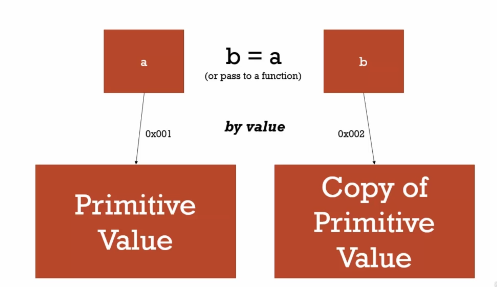
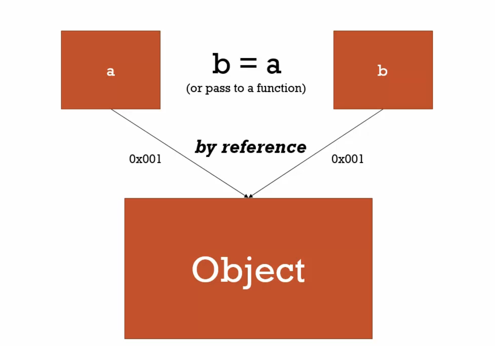

## 🐳 Concept Asides 名詞解釋

### 🦀 Namespace

> A container for variables and functions.  
> Typically to keep variables and function with the same name seperate.

JavaScript 本身並沒有 namespace，但可以透過善用 object 來儲存相同的命名方式，比如用不同的 object 來儲存都叫做 greet 的變數名稱。

```javascript
const english = { greet: "Hello!" };
const spanish = { greet: "Hola!" };

console.log(english.greet);
console.log(spanish.greet);
```

### 🦀 First Class Function
> Everything you can do with other types you can do with functions.  
> Assign them to variables, pass them around, create them on the fly.

### 🦀 Mutate
> To change something.  
> **Immutable** means it can't be changed. 

### 🦀 Arguments
> The parameters you pass to a function.  
> Jacascript gives you a keyword of the same name which contains them all.

## 🐳 Objects and Dot

在前面的影片當中有提到 object 是一對 key、value 的集合，那麼在記憶體當中，object 是如何儲存的呢？

一個 object 裡面的所有 property 會被存在各個記憶體位址，然後 object 所在的記憶體位址則會記得指向其他 property 被保存的記憶體位址。如下圖所示：


## 🐳 Funtcions are Objects

在 JavaScript 當中 function 就是 object 的一種，所以 function 擁有所有 object 的特性，但同時 function 也有一些自己的特點，例如： function 可以是匿名的，而且 function 有一段自己的 code（可以理解為 function 的其中一個 property 是 code），並且可以透過呼叫 `()` 來執行。如下圖所示：


所以其實這樣寫也是行得通的，因為 function 就是 object：
```javascript
function greet() {
    console.log("Hello!");
}

greet.lang = "english";

console.log(greet.lang);
```

## 🐳 Function Statements and Function Expressions

在 JavaScript 當中有兩種方式可以用來宣告 function，分別是：敘述式（function statement）和表達式（function expression）。

### 🦀 Function Statement 敘述式

敘述式的寫法如下：
```javascript
function greeting() {
    console.log('hi');
}
```

### 🦀 Function Expression 表達式

表達式的寫法如下：
```javascript
const greeting = function() {
    console.log('hi');
};
```

或是用箭頭函式：
```javascript
const greeting = () => {
    console.log('hi');
};
```

### 🦀 兩者之間的差別

來看看這兩段程式碼就可以很清楚的知道敘述式和表達式的差別：
```javascript
greet();

function greet() {
    console.log("hi!");
}
```

```javascript
greet();

const greet = function() {
    console.log("hi!");
};
```

把這兩段程式碼丟去執行的話，可以看到第一個部分的程式碼能夠成功執行並印出 "hi"，因為在使用敘述式時，function 會被 hoisting，所以可以將執行的語法寫在宣告 function 之前。

但是在執行第二部分的程式碼時卻會出錯，因為雖然第二段的程式碼也會進行 hoisting，但被 hoisting 的只有變數本身而已，賦值這個動作並不會被 hoisting，所以在宣吿 greet 之前就呼叫執行它的話， greet 會進入暫時死區並且報錯（因為在這邊使用 const 的關係）。

從這個例子可以知道，敘述式和表達式的最大差別就是在 hoisting 的時候結果會不太一樣，而為了避免可能會產生報錯，盡量都在執行 function 之前先宣吿 function 才是比較好的選擇。

## 🐳 By Value and By Reference

### 🦀 By Value

目前有下列的程式碼：
```javascript
const a = 1; // primitive value
b = a;
```

如果 a 這個變數的值是一個 primitive type（例如數字、字串、布林值等等）的話，當我們將 a 賦值給 b 的時候，其實是會將 a 的值複製出一個新的，然後將它儲存在另外一個新的記憶體區塊，再把新的記憶體區塊 reference 到 b，如下圖所示：


### 🦀 By Reference

接下來以下面的程式碼範例為例，來舉例什麼是 **by reference**：
```javascript
const a = { firstName: 'John', LastName: 'Walker' };
const b = a;

b.firstName = 'Ben';
console.log(b.firstName);
console.log(a.firstName); // a.firstName 會印出什麼？
```

從上述程式碼中可以知道，我們將 a 這個變數指向一個 object，然後再將 b 指向 a，最後去修改 b 這個 object 裡面的 property，但結果卻發現 a 裡面的 property 也被我們修改到了，也就是說我們不管是修改 b 或是修改 a 都會修改到同一個 object。

為什麼會發生上述這件事呢？是因為當資料型態是 reference type (object, array...) 的時候，JavaScript 是透過 **by reference** 去傳遞參數的，也就是如下圖所示：



其實 a 和 b 這兩個變數都指向同一個記憶體區塊（也就是 object 的所在位置），所以不管是透過 a 或 b 來修改 object，都是修改到同樣的東西。

:::info
**小小結論**：知道 **by value** 和 **by reference** 的差別，有助於程式開發和除錯。在這邊會討論到 **by value** 和 **by reference** 的差別主要是因為，當我們在進行程式開發或是除錯的時候，會需要處理非常多各式各樣的資料型態。當如果不小心改動的原本的資料時，可能會導致某些 function 出錯，此時知道 **by value** 和 **by referenct** 的差異可以更好的去避免改動到原始資料，降低產生 bug 的機率！
:::

## 🐳 Objects, Funcitons, and `this`

前面的幾部影片有提到 function 在執行的時候，會有一個 funciton 自己的 execute content 和 variable environment，並透過 scope chain 去拿到 outer environment 的變數，除此之外還會有一個東西——叫做 `this`，接下來這個部分會特別針對 `this` 來做說明。

首先，先來看看幾個簡單的例子：
```javascript
console.log(this);
```

```javascript
function a() {
    console.log(this);
}

a();
```

```javascript
const b = funciton() {
    console.log(this);
}

b();
```

如果我們將上述三個程式碼放到瀏覽器當中去執行的話，可以知道這三個印出來的東西都是 window，也就是說，按照上面的方式（寫在 function 當中然後直接執行，或是直接執行）去呼叫 `this`，它所指向的東西都是 window 這個 global object。

接下來我們試試用在 object 裡面建立 method 的方式來呼叫 `this`：
```javascript
const c = {
    name: 'The c object',
    log: function() {
      console.log(this);
    },
};

c.log();
```

當我們將上述的程式碼丟到瀏覽器的環境中執行時， `this` 會印出 c 這個 object，也就是說透過一個 object 來呼叫其中的 method 的話，此時的 `this` 會指向該 object。接下來我們繼續看看下一個範例：
```javascript
const c = {
    name: 'The c object',
    log: function() {
        console.log(this);

        const setName = function(newName) {
            this.name = newName;
        }

        setName('Update c object!');
        console.log(this);
    },
};

c.log();
```

按照上上一個程式碼範例的認知，如果在一個 object method 裡面呼叫 `this`，那麼 `this` 就會指向該 object，但當我們執行 `c.log()` 之後，裡面的 `setName` function 似乎並沒有成功地幫我們將 `c.name` 修改成新的名字。反而在 window 這個 global object 下面，找到了 `window.name === 'Update c object'`。也就是說 `setName` function 裡面的 `this` 是指向 window，並不是指向 object c。

為了要讓 `this` 能夠一直指向 object c，我們可以把程式碼修改成下面這樣：
```javascript
const c = {
    name: 'The c object',
    log: function() {
        const self = this; // 多加這一行，然後所有的 this 都改用 self
        console.log(self);

        const setName = function(newName) {
            self.name = newName;
        }

        setName('Update c object!');
        console.log(self);
    },
};

c.log();
```

只要將 `this` 賦值給一個變數後，然後在其他所有有用到 `this` 的地方都改用該變數， 這樣寫在 `c.log()` 裡面的任何 function 都能夠透過 scope chain 去找到該變數指向的 `this` 了（也就是 object c）。

:::info
**小小結論**：如果在 function 裡面呼叫 `this`，然後在 global 當中執行，通常 `this` 會指向 window，如果是呼叫放在 object 當中的 function 的話，呼叫的 `this` 則會指向該 object，但如果是在 object 的 function 中還有另一個內部的 function，這個內部的 function 呼叫的 `this` 會指向 window，為了避免這樣的 bug，可以先在 object function 裡面的最上方將 `this` 賦值給某個變數（通常會寫成 `const self = this`）。
:::

## 🐳 'arguments' and Spread

### 🦀 arguments

在開始說明什麼是 `arguments` 之前，我們先來看一個普通的 function：
```javascript
function greet(firstName, lastName, language) {
    console.log(firstName);
    console.log(lastName);
    console.log(language);
    console.log('----------');
}

greet();
greet('John');
greet('John', 'Doe');
greet('John', 'Doe', 'en');
```

在上述的 function 當中，雖然 `greet()` 這個 function 需要傳三個變數進去，但如果少傳了任何一個，Javascript 並不會報錯，而是會將沒有傳入任何值的變數預設成 `undefined`。而這樣的特性也就表示，可以很簡單的對一個變數設置一個預設值，比如，如果沒有傳 `language` 這個變數進去的話，先將其預設值設成 `'en'`，可以這樣寫：
```javascript
function greet(firstName, lastName, language = 'en') {
    console.log(firstName);
    console.log(lastName);
    console.log(language);
    console.log('----------');
}
```

或是比較舊的寫法：
```javascript
function greet(firstName, lastName, language) {
    language = language || 'en';

    console.log(firstName);
    console.log(lastName);
    console.log(language);
    console.log('----------');
}
```

在一個 function 當中，除了傳進去的變數之外，Javascript 也提供了一個稱作 `arguments` 的變數來接收傳進來的所有變數。此時我們可以來把上述的 function 改造一下，將 `arguments` 加進去，然後看看會發生什麼事情：
```javascript
function greet(firstName, lastName, language) {
    console.log(firstName);
    console.log(lastName);
    console.log(language);
    console.log(arguments); // 將 Javascript 內建的 arguments 加入
    console.log('----------');
}

greet();
greet('John');
greet('John', 'Doe');
greet('John', 'Doe', 'en');
```

可以看到執行四遍的 `greet()` 分別印出了以下四個不同的 `arguments`：
```
[]
['John']
['John', 'Doe']
['John', 'Doe', 'en']
```

從印出的結果當中可以知道 `arguments` 是一個可以收集所有傳進 function 的變數的類 array，為什麼會說它是類 array 是因為它長得很像 array，可以做到一些跟 array 很像的事情，但 array 的某些特性它沒有。

這時候我們就可以用 `arguments` 來做一些事情，比如可以檢查有沒有變數傳進來，如果沒有就報錯：
```javascript
function greet(firstName, lastName, language) {
    if (arguments.length === 0) {
        console.log('Missing parameters');
        return;
    }
    console.log(firstName);
    console.log(lastName);
    console.log(language);
    console.log(arguments); // 將 Javascript 內建的 arguments 加入
    console.log('----------');
}
```

### 🦀 spread

spread 簡單來說就是很常看到的 `...`。而這個 `...` 實際上有什麼用途呢？目前我所知道的用法主要有三個：
1. 如果傳入某個 function 的變數可能是OO個和OO個以上，這個「以上」的部分可以用 `...` 包起來。
2. 可以用來解構 array。
3. 可以用來解構 object。

廢話不多說，直接用實際的例子來看看：
```javascript
function greet(firstName, lastName, language, ...others) {
    console.log(firstName);
    console.log(lastName);
    console.log(language);
    console.log(others);
}

greet('John', 'Doe', 'en', 1, 2, 3, 4);
```

在上述的例子，可以看到 `others` 這個變數印出了 [1, 2, 3, 4]，這也就是說它將 `firstName, lastName, language` 之外的值都包在 `others` 這個 array 裡面，這也就是表示這個 function 可以傳入三個或三個以上的值。

接著來看看解構的例子：
```javascript
const arr1 = [1, 2, 3, 4, 5, 6, 7, 8, 9, 10];
const arr2 = [...arr1];
```

在上述程式碼中，可以透過 `...` 拿到 arr1 裡面的每個元素，然後再把它放到 arr2 來達到淺拷貝。用在 object 當中也是同樣的道理。如此一來便可以輕鬆達到淺拷貝。