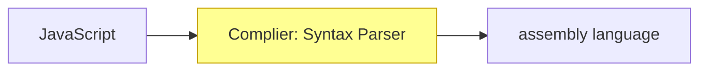

# Execution Contexts & Lexical Environments

- [Execution Contexts & Lexical Environments](#execution-contexts--lexical-environments)
  - [:whale: Concept Asides 名詞解釋](#whale-concept-asides-名詞解釋)
    - [:crab: Syntax Parser 語意分析](#crab-syntax-parser-語意分析)
    - [:crab: Lexical Environment 詞彙環境](#crab-lexical-environment-詞彙環境)
    - [:crab: Execution Context 執行環境](#crab-execution-context-執行環境)
    - [:crab: Name/Value Pair](#crab-namevalue-pair)
    - [:crab: Object](#crab-object)
    - [:crab: JavaScript and 'undefined'](#crab-javascript-and-undefined)
    - [:crab: Single Threaded 單執行緒](#crab-single-threaded-單執行緒)
    - [:crab: Synchrnous Execution 同步執行](#crab-synchrnous-execution-同步執行)
  - [:whale: The Global Environment and The Global Object](#whale-the-global-environment-and-the-global-object)
  - [:whale: The Execution Context](#whale-the-execution-context)
    - [:crab: Creation and Hoisting](#crab-creation-and-hoisting)
    - [:crab: Code Execution](#crab-code-execution)
  - [:whale: Function Invocation and the Execution Stack(Call Stack)](#whale-function-invocation-and-the-execution-stackcall-stack)
  - [:whale: Functions, Context, and Variables Environments](#whale-functions-context-and-variables-environments)
  - [:whale: The Scope Chain](#whale-the-scope-chain)
  - [:whale: Scope, ES6, and let](#whale-scope-es6-and-let)
  - [:whale: What about Asynchronous Callbacks?](#whale-what-about-asynchronous-callbacks)

## :whale: Concept Asides 名詞解釋

### :crab: Syntax Parser 語意分析

>  A program that reads your code and determines what it does and if its grammar is valid.

當我們在寫 JavaScript 的時候，寫完之後其實電腦是看不懂的，而是需要透過編譯器(complier) 來翻譯成電腦看得懂的語言，才能夠幫我們執行我們想要實現的功能。



### :crab: Lexical Environment 詞彙環境

>  Where something sits physically in the code you write.

當我們在寫 JavaScript 的時候，Lexical Environment 關注的是這個 function 被寫在這個程式中的哪個部分，以及它周遭的環境是什麼，有了 Lexical Environment，可以讓 Syntax Parser 更容易解析整個程式碼，比如說以下的程式碼：

```javascript
function Greeting() {
    const a  = "Hello World!";
    console.log(a);
}

// a 這個變數是存在於 Greeting 這個函數的環境中
```

並不是所有的程式語言都有 Lexical Environment，但 JavaScript 有。

### :crab: Execution Context 執行環境

> A wrapper to help manage the code that is running.
> There are lots of lexical environments. Which one is currently running is managed via execution contexts. It can contain things beyond what you've written in your code.

當我們寫好程式碼之後，我們該如何知道它是按照什麼樣的順序被電腦執行的？整個程式碼的執行流程是如何安排的？這就是 Execution Context 需要做的工作。

### :crab: Name/Value Pair

> A name which maps to a unique value.
> The name may be defined more than once, but only can have one value in any given **context**.
> That value may be more name/value pairs.

### :crab: Object

> A collection of name/value pairs.
> The simplest definition when talking about **JavaScript**.

### :crab: JavaScript and 'undefined'
直接來看看兩個不同的例子：

```javascript
// 範例一
var a;
console.log(a);

// 印出 undefined
```

```javascript
// 範例二
console.log(a);

// 報錯：印出 Uncaught ReferenceError: a is not defined
```

我們可以知道範例一和範例二都印出了東西，但 undefined 和 is not defined 從英文字面上來看不是一樣的意思嗎？其實這兩者對 JavaScript 來說是兩個不一樣的東西。

**undefined** 在這裡的意思是：JavaScript 已經為這個變數預留了一個記憶體的位置，但因為這個變數還沒有被賦值，所以 JavaScript 就先暫時設了一個初始值給你，然後這個初始值叫做「undefined」。所以我們可以把 undefined 理解為「尚未設定的值」。

**is not defined** 的意思則是：JaveScript 在記憶體位置當中並沒有尋找到該變數，所以它就會報錯，告訴我們 `Uncaught ReferenceError: a is not defined`。

### :crab: Single Threaded 單執行緒
> One command at a time.
> Under the hood of the browser, maybe not.

JavaScript 是一個單執行緒的語言，也就是說 JavaScript 在執行的時候，一次只能做一件事情。但是如果我們是在 browser 這個環境之下執行 JavaScript，browser 本身可以幫我做到多執行緒的事情，但是就像開頭提到的 JavaScript 本身是一個單執行緒的語言。

### :crab: Synchrnous Execution 同步執行
> One at a time and in order.

JavaScript 是同步執行的，也就是說做完一件事情，才會做下一件事情，而且會按照事情排好的順序依序做下去。

## :whale: The Global Environment and The Global Object

當 JavaScript 在執行的時候，它一定會在一個全域執行環境 (Global Environment) 當中執行，在這個環境當中會有一個全域物件 (Global Object)，以及一個很特殊的 variable 「this」。

```
┌───────────────────────────────────────────────────────────┐
│ Execution Context(Global)                                 │
│      ┌──────────────────┐     ┌───────────────────┐       │
│      │                  │     │                   │       │
│      │   Global Object  │     │        this       │       │
│      │                  │     │                   │       │
│      └──────────────────┘     └───────────────────┘       │
└───────────────────────────────────────────────────────────┘
```

當我們在瀏覽器中執行 JavaScript 時，瀏覽器是一個 runtime，所以此時 JavaScript 所在的 Global Execution Context，就是瀏覽器的全域環境，在這個環境裡有一個 Global Object 叫做「window」。當我們在這個全域環境當中直接打 `console.log(this);` 的時候，`this` 指的就是 `window`。至於當我們在 node.js 當中執行 JavaScript 時，此時的 Global Object 和 this 就會是 node.js 設定好的。

假設目前在瀏覽器中使用 `var` 宣告一個變數 a ，而且這個變數 a 等於 1 時，其實就是在瀏覽器當中的 Global Object 中建立一個 Name/Value Pair，所以可以透過 `window.a` 這個指令來找到剛才宣告的變數 a。如以下程式碼所示：

```javascript
var a = 1;

a // 1
window.a // 1
```


|:bulb: **特別注意** :bulb:|
|---|
|es6 新增了兩個新的宣告方式 `const` 以及 `let`，這兩個的用法與 `var` 不同，如果在全域環境使用 `const` 或 `let`，並不會在 Global Object 中建立一個 Name/Value Pair，避免了一些使用 `var` 會產生的問題。這三者的比較可能會之後再寫一篇筆記做更深入探討。|

## :whale: The Execution Context

### :crab: Creation and Hoisting
在開始說明 JavaScript Engine 如何創建執行環境時，我們先來看看 JavaScript 的特殊現象「Hoisting」。首先來看看以下範例一的程式碼：

```javascript
// 範例一
var a = 'Hello World!';

function b() {
    console.log('Called b!');
}

b();
console.log(a);
```

將上述的程式碼執行之後，我們可以很輕鬆也如常的預期會先印出 `Called b!`，再印出　`Hello World!`，但如果我們把程式碼改成下面這樣呢？

 
 ```javascript
// 範例二
b();
console.log(a);

var a = 'Hello World!';

function b() {
    console.log('Called b!');
}
```

如果程式碼是從上到下，一行一行依序執行的話，照理來說在跑第一行的時候就會報錯，因為我們在尚未宣告變數和函數時，就對該變數或函數進行呼叫。但在 JavaScript 裡面卻不是這樣，將以上程式碼執行之後，JavaScript會幫我們印出：

```javascript
Called b!
undefined
```

JavaScript 並沒有幫我們報錯，反而印出東西來，這是因為在這當中存在著「Hoisting」的現象。很多網路上對「Hoisting」的解釋大部分都是：想像 JavaScript Engine 將所寫的宣告的程式碼（但如果是宣告變數的話，只會提升宣告的變數，不會連同賦值的部分一起提升）提升到最上面的地方，比如想像範例二的程式碼變成如下：

```javascript
funciton b() {
    console.log('Called b!');
}

var a;

b();
console.log(a);

a = 'Hello World!';
```

所以我們才會得到印出 `Called b!` 和 `undefined` 的結果。但其實 JavaScript Engine 並不會真的去調動你所寫的程式碼的位置，所以「**想像 JavaScript Engine 將所寫的宣告的程式碼（但如果是宣告變數的話，只會提升宣告的變數，不會連同賦值的部分一起提升）提升到最上面的地方**」這樣的描述雖然能夠解釋 Hoisting 這個現象，但它並沒有精確地去描述 JavaScript Engine 在 Hoisting 的時候實際上到底做了什麼。

所以 JavaScript Engine 到底做了什麼？在 Execution Context 被創建之後，除了同時創建了 Global Obeject、this 之外，還會同時先預留記憶體位置給變數與函式。

這個「**先預留記憶體位置給變數與函式**」的動作就是 Hoisting。但要特別注意的地方是：當宣告的 function 被 hoisted 的時候，除了 funciton 的名稱會被 hoisted，整個 funciton 裡面的 code 也會被 hoisted。但如果是使用 `var` 來宣告變數的時候，只有變數的名稱會被 hoisted，賦值這個動作並不會被 hoisted，然後 JavaScript Engine 會將所有被 hoisted variable 的初始值設為 undefined。

```
┌────────────────────────────────────────────────────────────────────────────────────┐
│                                                                                    │
│  Execution Context is Created (Creation Phase)                                     │
│                                                                                    │
│      ┌────────────────────┐    ┌───────────────────┐      ┌──────────────────┐     │
│      │      Global        │    │                   │      │      Outer       │     │
│      │                    │    │      'this'       │      │                  │     │
│      │      Object        │    │                   │      │   Environment    │     │
│      └────────────────────┘    └───────────────────┘      └──────────────────┘     │
│                                                                                    │
│      ┌───────────────────────────────────────────────────────────────────────┐     │
│      │      Set up Memory Space for Variables and Functions                  │     │
│      │                                                                       │     │
│      │            "Hoisting"                                                 │     │
│      └───────────────────────────────────────────────────────────────────────┘     │
│                                                                                    │
└────────────────────────────────────────────────────────────────────────────────────┘
```


|:bulb: 特別注意 :bulb:|
|---|
|盡量在執行函數或使用變數之前先宣告他們，不要過度依賴於 Hoisting 的現象。因為你不知道你宣告的變數有沒有可能會變成 undefined。|


### :crab: Code Execution
JavaScript 在執行程式碼的時候就比較好理解了，不會有什麼 Hoisting 啦之類的奇怪的事情發生，就是我們寫好的程式碼會被 JavaScript Engine 在它該在的環境當中被一行一行的執行。但要特別注意的是，JavaScript 是單執行緒的語言喔。

```
┌────────────────────────────────────────────────────────────────────────────────────┐
│                                                                                    │
│  Execution Context is Created (Execution Phase)                                    │
│                                                                                    │
│      ┌────────────────────┐    ┌───────────────────┐      ┌──────────────────┐     │
│      │      Global        │    │                   │      │      Outer       │     │
│      │                    │    │      'this'       │      │                  │     │
│      │      Object        │    │                   │      │   Environment    │     │
│      └────────────────────┘    └───────────────────┘      └──────────────────┘     │
│                                                                                    │
│      ┌───────────────────────────────────────────────────────────────────────┐     │
│      │                                                                       │     │
│      │                            Runs Your Code                             │     │  
│      │                                                                       │     │
│      └───────────────────────────────────────────────────────────────────────┘     │
│                                                                                    │
└────────────────────────────────────────────────────────────────────────────────────┘
```


## :whale: Function Invocation and the Execution Stack(Call Stack)
> **nvocation**: running a function
> In JavaScript, we can use parenthesis() to invocate function.

當使用 JavaScript 呼叫函式的時候，底層做了什麼樣的事情？換句話說，函式被我們呼叫以後，JavaScript 是怎麼執行這些函式的？我們可以試著用以下的程式碼來舉例：

```javascript
function b() {
    
}

function a() {
    b();
}

a();
```

當我們開始執行以上的程式碼的時候，首先會先在 Execution Stack 裡面建立一個 Global Execution Context，接著當程式碼一行一行跑下來跑到 `a()` 然後執行 `a` 這個函式的時候，JavaScript 會為這個函數創建它的 Execution Context，並將它放到 Execution Stack（執行堆疊）當中，疊在 Global Execution Context 上面。

然後因為 `a()` 函式被執行了，連帶 `a()` 當中的 `b()` 也被執行，所以 JavaScript 也為 `b()` 函式創建了一個 Execution Context，而 `b()` 的 Execution Context 會疊在 `a()` 上面。

在 Execution Stack 當中函式的執行順序是由上往下執行的，也就是說，以此範例為例，會先執行 `b()`、在執行 `a()`，當 `b()` 執行完之後，`b()`就會離開執行堆疊（英文稱作 pop off），以此類推。

```
                   .
                   .
│                  .                  │
│                  .                  │
│                  .                  │
│                  .                  │
│                                     │
│ ┌─────────────────────────────────┐ │ ────► Execution Stack
│ │             b()                 │ │
│ │      Execution Context          │ │
│ │     (create and execute)        │ │
│ └─────────────────────────────────┘ │
│                                     │
│ ┌─────────────────────────────────┐ │
│ │            a()                  │ │
│ │      Execution Context          │ │
│ │     (create and execute)        │ │
│ └─────────────────────────────────┘ │
│                                     │
│ ┌─────────────────────────────────┐ │
│ │    Global Execution Context     │ │
│ │  (created and code is executed) │ │
│ └─────────────────────────────────┘ │
│                                     │
└─────────────────────────────────────┘
```

## :whale: Functions, Context, and Variables Environments
> **Variable Environment**: where the variables live and how they realte to each other in memory

在每個 Execution Context 被創建之後，同時該 Execution Context 也會有一個自己的 Variable Environment。我們可以透過以下的程式碼為例，來說明 Variable Environment 在 JavaScript 中是如何被建立的。

```javascript
function b() {
    var myVar;
}

function a() {
    var myVar = 2;
    b()
}

var myVar = 1;
a()
```

當上述程式碼被執行之後，myVar 會是什麼值？程式碼執行後，JavaScript Engine 會分別在 Global、a()、b() 各自的 Execution Context 中各建立一個 Variable Environment，所以 myVar 在不同的 Execution Context 當中就會有不同的值，需要先觀察目前程式碼執行到哪邊，再去判斷 myVar 目前的值。如下圖：

```
│                                                        │
│                                                        │
│                                                        │
│                                                        │
│   ┌───────────────────────────────────────────────┐    │  ───────► Execution Stack
│   │                  b()                          │    │
│   │                                               │    │
│   │           Execution Context       ┌─────────┐ │    │
│   │                                   │   myVar │ │    │
│   │          (create and execute)     │undefined├─┼────┼──────┐
│   └───────────────────────────────────┴─────────┴─┘    │      │
│                                                        │      │
│   ┌───────────────────────────────────────────────┐    │      │
│   │                  a()                          │    │      │
│   │                                               │    │      │
│   │           Execution Context         ┌───────┐ │    │      │
│   │                                     │ myVar │ │    │      │
│   │          (create and execute)       │   2   ├─┼────┼──────┼─────► Variable Environment
│   └─────────────────────────────────────┴───────┴─┘    │      │
│                                                        │      │
│   ┌───────────────────────────────────────────────┐    │      │
│   │                                               │    │      │
│   │      Global Execution Context                 │    │      │
│   │                                     ┌───────┐ │    │      │
│   │    (created and code is executed)   │ myVar │ │    │      │
│   │                                     │   1   ├─┼────┼──────┘
│   └─────────────────────────────────────┴───────┴─┘    │
│                                                        │
└────────────────────────────────────────────────────────┘
```

## :whale: The Scope Chain
還記得我們在前面提到，程式碼執行之後，會為每個執行的函數建立自己的 Execution Context、自己的 Variable Environment。現在我們要談到，當程式碼執行後除了會建立上述提到的部分，還會建立一個 Outer Environment，意思就是指會建立一個對外的 Scope 參照。

總結來說，當一個 Execution Context 被建立的時候，裡面會有以下幾種東西：
- Global Object
- this
- Hoisting
- Outer Environment
- Variable Environment

所以，建立一個對外的 Scope 參照是什麼意思？

如果用文字敘述來說明的話，指的是 JavaScript Engine 會去檢查該程式碼（比如說某個 function）的 Lexical Environment，也就是去檢查某個 funciton 的所在位置，再將該 function 所在位置的 variable environment 當作參照。

比如某個 function 是在全域環境中宣告的，那麼當 JavaScript Engine 在執行該 function 的時候，除了會建立 function 自己的 variable environment 之外，也會去參照這個 function 所在位置的 variable environment，也就是全域環境的 variable environment。

而上述提到的這種行為，便會導致一個稱為「Scope Chain」的現象發生。我們現在可以來看看以下幾個不同的程式碼，來更加了解 Scope Chain。

---

首先來觀察狀況一，`b()` 裡面的 `console.log(myVar)` 會印出什麼？
```javascript
// 狀況一
function b() {
    console.log(myVar);
};

function a() {
    var myVar = 2;
    b();
};

var myVar = 1;
a()
```

因為 `b()` 裡面並沒有宣告 `myVar` 這個變數，所以 JavaScript Engine 會藉由 Lexical Context 去檢查 `function b` 在哪個環境被宣告的，檢查之後發現是在全域，於是 JavaScript Engine 又在全域環境中檢查是不是有 `myVar` 這個變數，然後發現有，於是便印出 `1`。

---

接下來來看看狀況二，在狀況二的程式碼中，`b()` 裡面的 `console.log(myVar)` 會印出什麼？

```javascript
// 狀況二
function a() {
    function b() {
        console.log(myVar);
    };
    
    var myVar = 2;
    b();
};

var myVar = 1;
a();
```

因為 `b()` 裡面並沒有宣告 `myVar` 這個變數，所以 JavaScript Engine 會藉由 Lexical Context 去檢查 `function b` 在哪個環境被宣告的，檢查之後發現是在 `a function` 裡面宣告的，於是 JavaScript Engine 又在 `a function` 的執行環境中檢查是不是有 `myVar` 這個變數，然後發現有，於是便印出 `２`。

---

接下來來看看狀況三，在狀況三的程式碼中，`b()` 裡面的 `console.log(myVar)` 會印出什麼？

```javascript
// 狀況三
function a() {
    function b() {
        console.log(myVar);
    };
    b();
}

var myVar = 1;
a();
```

因為 `b()` 裡面並沒有宣告 `myVar` 這個變數，所以 JavaScript Engine 會藉由 Lexical Context 去檢查 `function b` 在哪個環境被宣告的，檢查之後發現是在 `a function` 裡面宣告的，於是 JavaScript Engine 又在 `a function` 的執行環境中檢查是不是有 `myVar` 這個變數，然後發現沒有，於是又再繼續檢查 `a funciton` 是在哪個環境被宣告的，檢查之後發現是在全域環境，於是又再繼續檢查全域環境有沒有變數 `myVar`，然後終於發現有，於是便印出 `1`。

---

從以上三個狀況中，可以看到以下幾個步驟：
1. 某個函式被呼叫並執行
2. JavaScript Engine 檢查該函式的 Lexical Context，確定它的 Outer Environment（也就是函式被宣告的環境）。
4. 如果某個函式呼叫了一個自己的 Variable Environment 沒有的變數，JavaScript Engine 就會開始往 Outer Environment 的 Variable Environment 檢查有沒有那個變數。
5. 一直重複步驟 3，直到找到那個變數，或是找到最後發現沒有那個變數

這種不斷地往 Outer Environment 尋找 Variable 的現象就稱為「Scope Chain」。

## :whale: Scope, ES6, and let
> Scope: where a variable is available in your code.

在 ES6 以前，若想要宣告一個變數，只有 `var` 可以用，但在 ES6 公布之後，目前有 `var`、`const`、`let` 可以用來宣告變數。

這三者之間也有些許不同。用 `let` 和 `const` 宣告變數後，那個變數所在的 Scope 是一個 block Scope（例如用`{}`圍起來就是一個 block），而用 `var` 則會將變數宣告在 Function Scope 當中。

用 `var`、`const`、`let` 都會有 Hoisting 的現象，只是使用 `var` 時，會給予變數一個 undefined 的初始值，但如果是 `const`、`let` 的話，則是會讓變數存在暫時死區無法使用，然後報錯。


|| `var` | `const` | `let` |
|---| -------- | -------- | -------- |
|作用域| 函式作用域    | 區塊作用域    | 區塊作用域     | 
|Hoisting| undefined | 進入暫時死區，會報錯 | 進入暫時死區，會報錯|


## :whale: What about Asynchronous Callbacks?

在前面的影片有提到 JavaScript 是一個單執行緒、同步的語言（一次只做一件事情），但是在瀏覽器當中卻可以做到非同步（一次做很多件事情），這到底是如何辦到的？是因為有瀏覽器這個執行的環境，它可以先做一些非同步的處理，然後再將處理好的函數一一丟到 JavaScript Engine 當中去執行。

瀏覽器處理非同步的過程有個專有名詞稱為 Event Loop，也許之後可以再寫一篇筆記來記錄瀏覽器當中的 Event Loop 是如何運作的。


|[▶️ 回到 README](../README.md)|
|---|